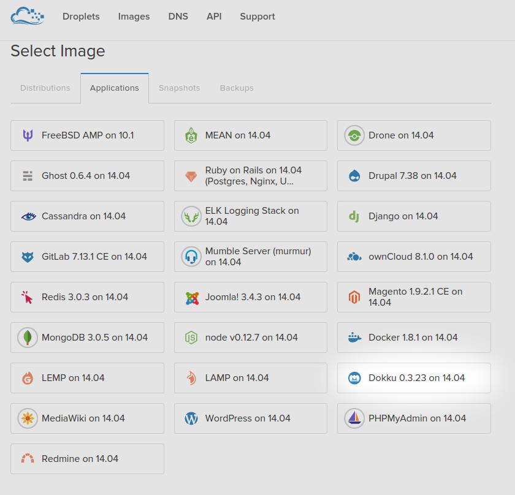
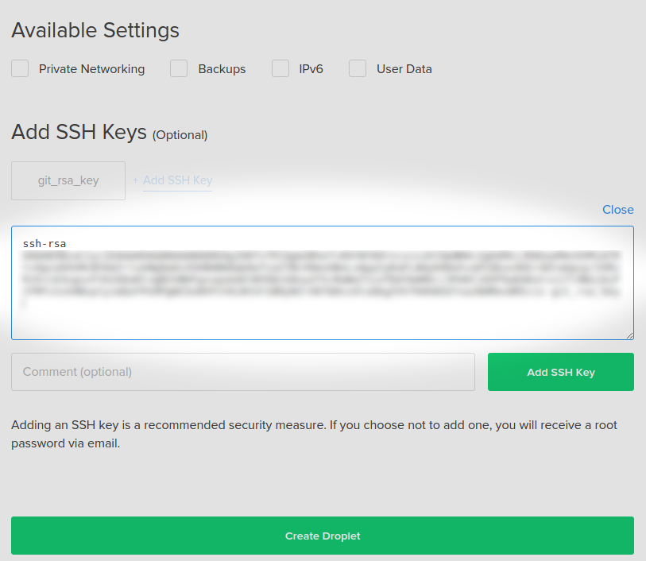
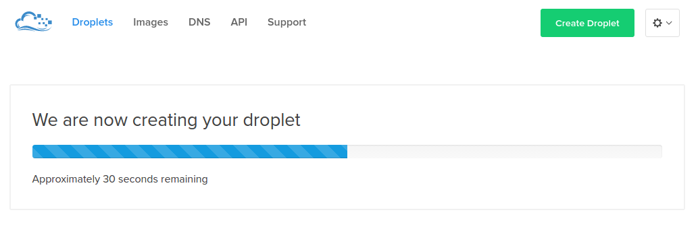
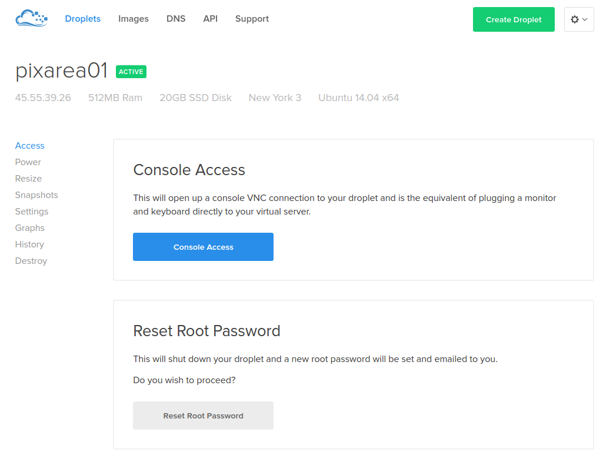
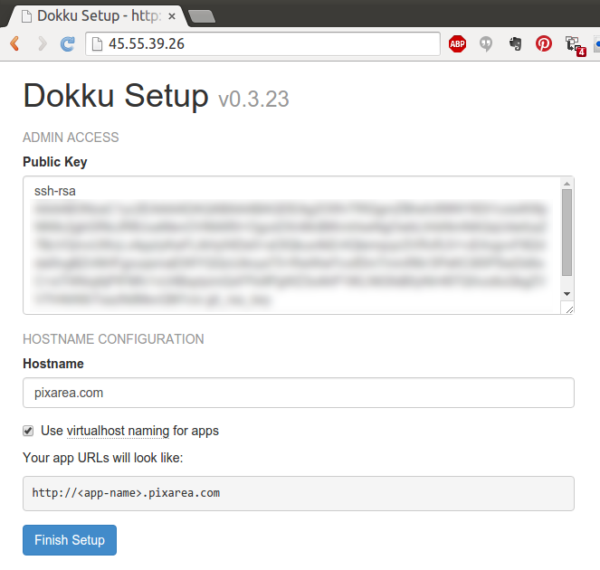
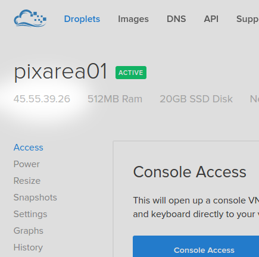
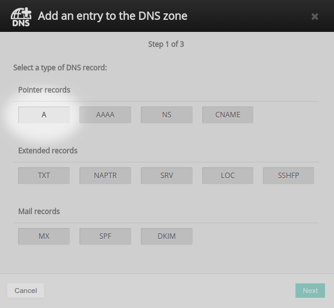
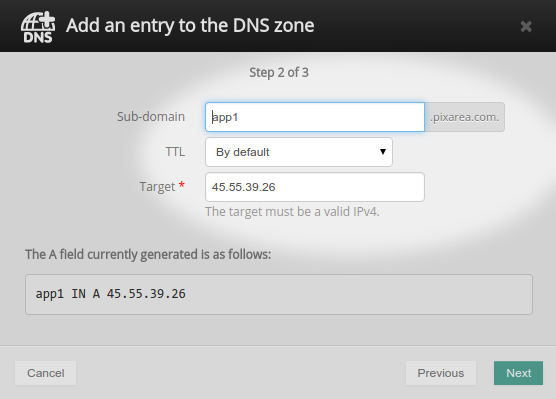
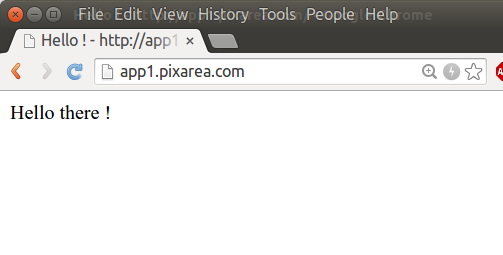
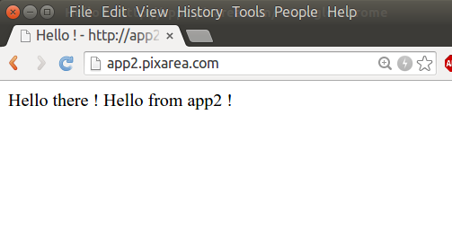

Ok... despite the online documentation and support forums, it took me some time to figure this out.

So here is a step-by step guide guide explaining how to host multiple apps on one unique dokku instance, on one unique Digital Ocean droplet, using subdmains that point to the different apps.

With this setup, we'ĺl be able to deploy each app with a simple `git push` like this:

    $ git push dokku master

And browse to our apps using subdomains, like:

* App 1: http://app1.pixarea.com
* App 2: http://app2.pixarea.com
* ...

All of this using only 1 droplet on Digital Ocean.

Before we begin:

- be sure to have a registered domain name that you can add subdomains to.

## 1. Setting up the dokku droplet on Digital Ocean

1. Go to https://www.digitalocean.com and login or signup.

2. Under "Droplets": click the big button "Create Droplet" on the right:

3. Name the droplet to your liking ("pixarea01" in this example), select the size and region.

4. Under "Select Image", choose "Applications" then "Dokku 0.3.23 on 14.04" or whatever newer version.

5. Add your public SSH key to be able to `ssh` to your droplet from your computer without having to type a password each time:

  * Just copy the content of your local "id_rsa.pub" file (`cat .ssh/id_rsa.pub`) and paste it here:

6. Now you can click on the nice green fat button "Create Droplet".

7. You should see this progress bar:

8. Then the control panel for your newly created droplet should appear:

9. Open a browser window and paste the IP address as the URL. This will lead you to dokku's first setup panel.

  Fill in the fields following the example below:

  * Paste-in your id_rsa.pub key again, this will allow you to `git push` your apps without having to type a password each time.

  * Be sure to check **"Use virtualhost naming fo apps"** !

  * Specify your domain name in the form "whatever.com", following my example:

 

... That's it, Yay !

Well done !!

## 2. Pointing the subdomains to your droplet

1. Note the IP address of your droplet, shown on the top left of the droplet panel

* In this example, it (still) is: `45.55.39.26`

2. Access the DNS config of your registrar, add your subdomains and point them to this IP:

  - In order to do that, add a new entry of type "A", then paste the droplet IP address you just copied:

* Repeat for every subdomain / app

## 3. Deploy the first app

I've prepared a very minimal nodejs app. You can use it for this exercice if you want.

You can check the code of this minimal example app here:

- https://github.com/danielres/minimal-nodejs-express-dokku-example

First, clone it into "app1":

    $ git clone https://github.com/danielres/minimal-nodejs-express-dokku-example.git app1
    $ cd app1

Add dokku as a remote git repo:

    $ git remote add dokku dokku@45.55.39.26:app1

or:

    $ git remote add dokku dokku@app1.pixarea.com:app1

The `:app1` part at the end tells dokku how to name the app, and has to match with the name of your subdomain, (ex: **app1**.pixarea.com) you defined earlier.

And now you can just deploy with:

    $ git push dokku master

You can now visit the url of your app (in this example: http://app1.pixarea.com)

And you should see something like this:

## 4. Repeat the process for other apps

1. Access the control panel of the registrar for the domain name
2. Add a new entry "app2" of type "A" that points to the droplet IP

Clone, then publish my example app (or one of your own apps) as "app2":

    $ git clone https://github.com/danielres/minimal-nodejs-express-dokku-example.git app2
    $ cd app2
    $ echo ' Hello from app2 !' >> public/index.html
    $ git add .
    $ git commit -m "Adapt welcome message to app 2"
    $ git remote add dokku dokku@45.55.39.26:app2
    $ git push dokku master

Check the result:

* If we browse to http://app2.pixarea.com now, we should see:

That's all folks !

Wish you some happy hosting / pushing / dropletting / deploying  !

